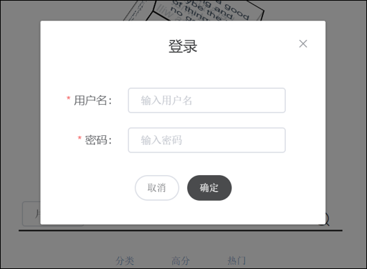
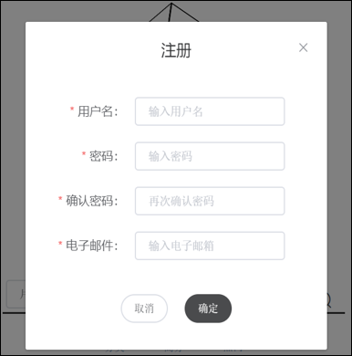
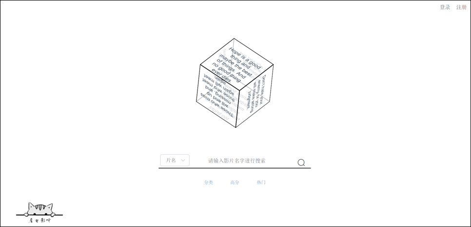
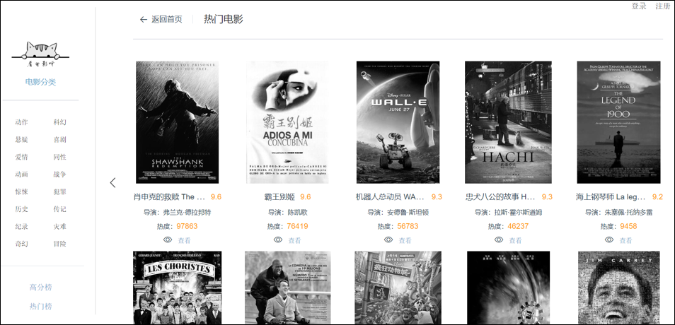
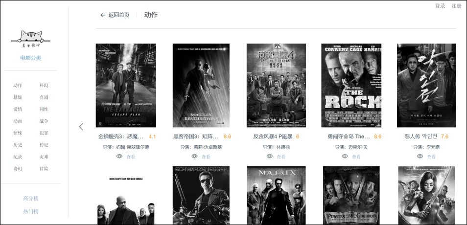
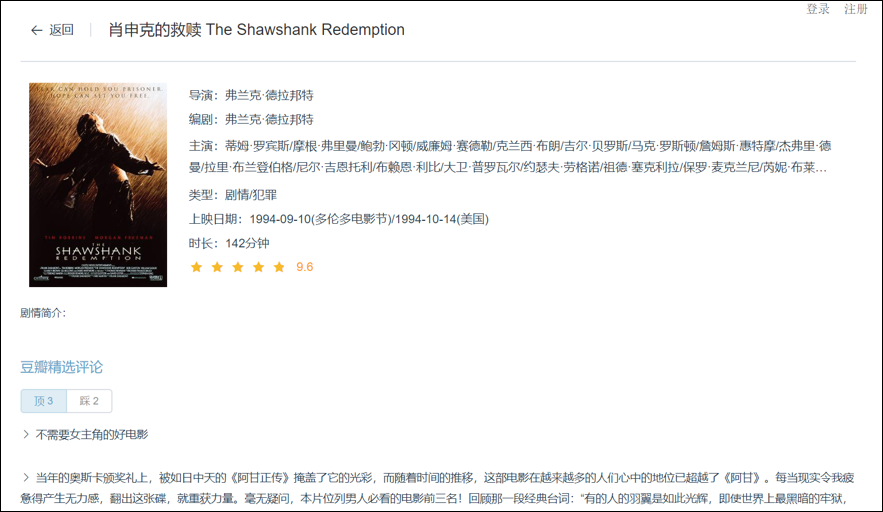
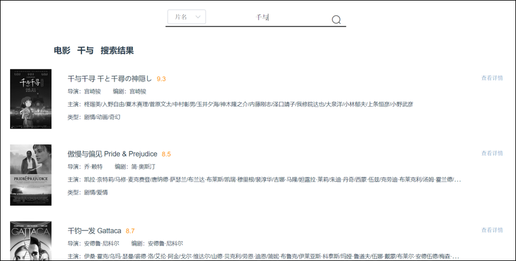

# movie_web

> A movie website like douban.

## preview

- login and register

  


- home page



- movie list

when mouse hover on image of a film, the image will change on size and color.






- film detail



- search film



## Build Setup

``` bash
# install dependencies
npm install

# serve with hot reload at localhost:8080
npm run dev

# build for production with minification
npm run build

# build for production and view the bundle analyzer report
npm run build --report
```

For a detailed explanation on how things work, check out the [guide](http://vuejs-templates.github.io/webpack/) and [docs for vue-loader](http://vuejs.github.io/vue-loader).
